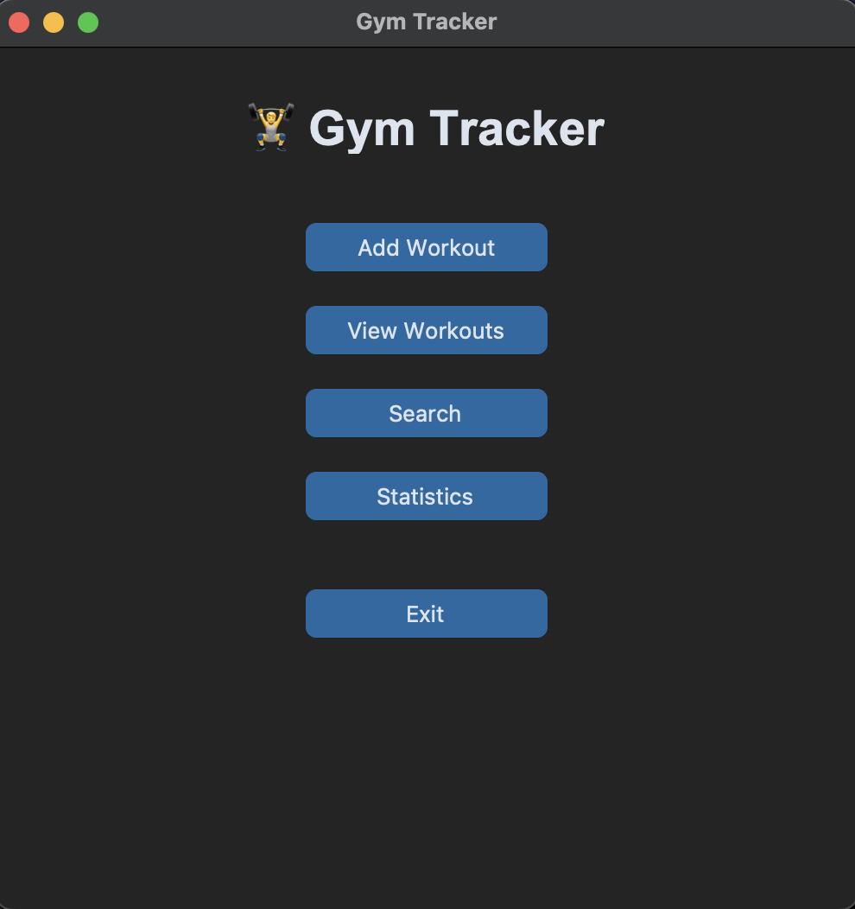
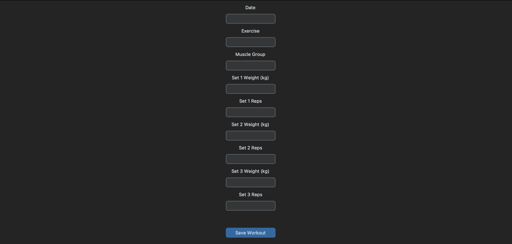
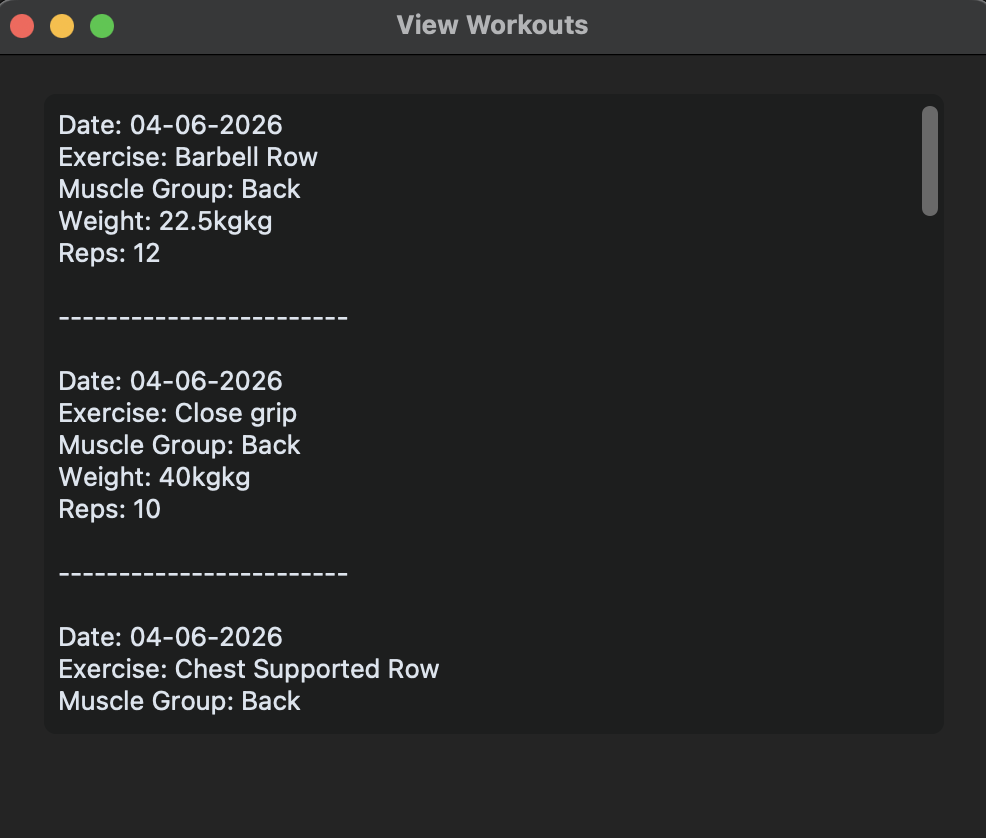

# Gym Tracker
A desktop-based workout tracking application built using Python, JSON, and CustomTkinter.

Gym Tracker helps users log workouts, track progress, monitor personal records, and manage their fitness journey through both a command-line interface and a graphical user interface.

## Features

- Add workouts with multiple sets
- View workout history
- Track workout statistics
- Monitor Personal Records (PRs)
- Search workouts by exercise
- Search workouts by muscle group
- Delete and edit workouts
- GUI-based workout entry and viewing
- Dynamic addition of unlimited sets
- GUI workout search with result display

## Version History
- V1 – Add and store workouts using JSON
- V2 – View workout history
- V3 – Workout statistics
- V4 – Personal Records (PR) tracking
- V5 – Search workouts by exercise
- V6 – Search workouts by muscle group
- V7 – Delete workouts
- V8 – Edit workouts and update set details
- V9 – Error handling and validation
- V10 – Refactored code using functions
- V11 – JSON persistence improvements
- V12 – GUI workout viewer using CustomTkinter
- V13 – GUI workout entry with multi-set support
- V14 – Dynamic set addition with unlimited workout sets
- V15 – GUI workout search with exercise and muscle group filters

## Technologies Used
- Python
- JSON
- Git & GitHub
- CustomTkinter

## Project Structure
 Gym Tracker/

- ├── gym_tracker.py # CLI version

- ├── gym_tracker_gui.py # GUI version

- ├── workouts.json # Workout database

- ├── README.md

## How To Run

### Clone the repository
- git clone <your-repository-url> cd Gym-Tracker
### Install dependencies
- pip install customtkinter
### Run the CLI version
- python3 gym_tracker.py
### Run the GUI version
- python3 gym_tracker_gui.py

## Screenshots
### Main Window

### Add Workout Form

### View Workouts

## Future Improvements
- Search functionality in GUI
- Statistics dashboard
- PR dashboard
- Export workouts to CSV
- Data visualizations and charts
- Remove individual sets from the GUI

## About This Project
I built Gym Tracker as a personal project to strengthen my Python programming skills before starting college. Through this project, I learned:

- File handling with JSON
- Functions and code refactoring
- Error handling
- CRUD operations
- GUI development using CustomTkinter
- Debugging and problem-solving
- Git and GitHub workflows

This project reflects my journey from writing simple Python scripts to building a functional desktop application.

## Author
Ayaan Mahajan

