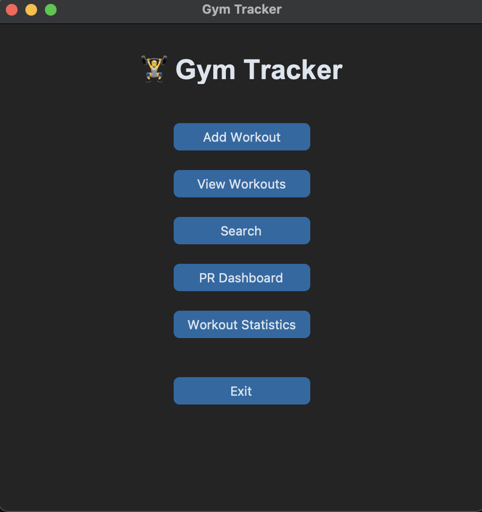
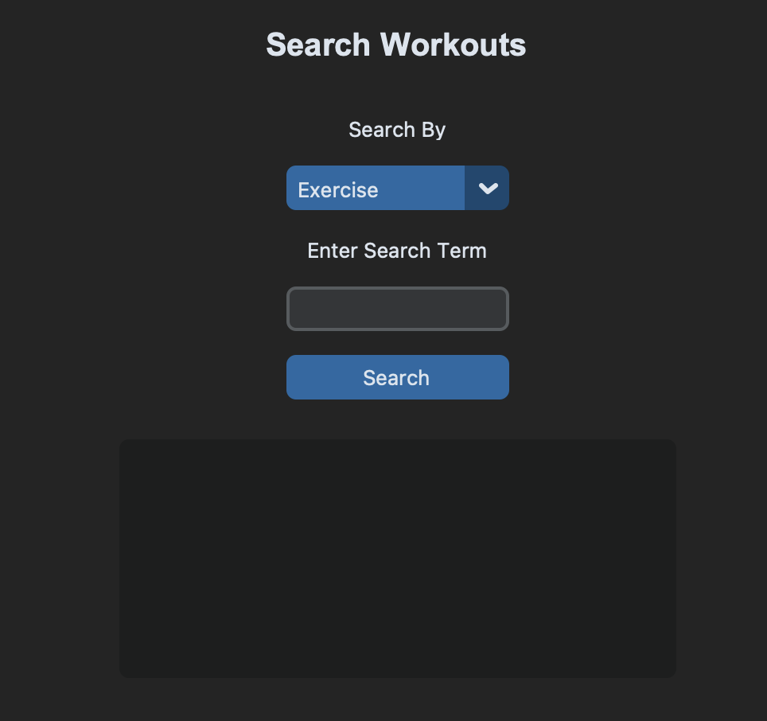
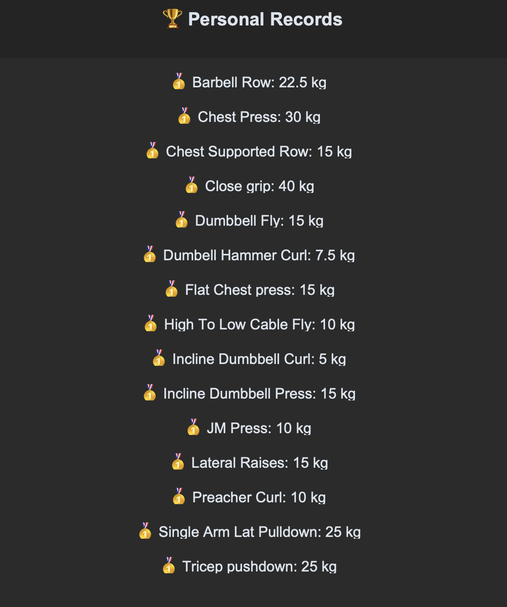
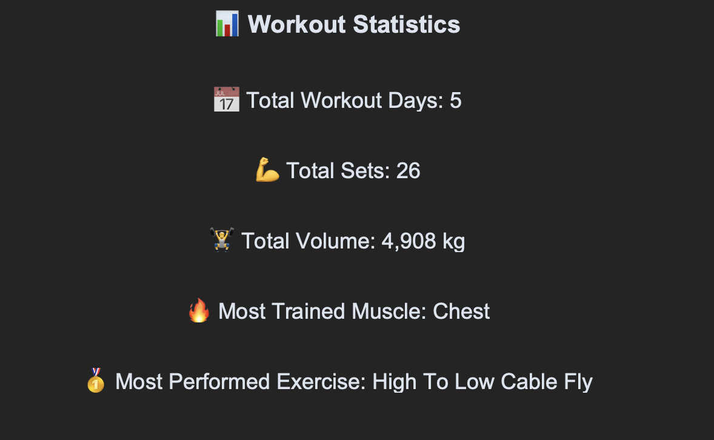

# Gym Tracker

Gym Tracker is a desktop-based fitness tracking and analytics application built using Python, JSON, and CustomTkinter. It allows users to log workouts, track progress, monitor personal records, and gain insights into their training patterns through an intuitive graphical interface.

## Features

- Add workouts with multiple sets
- View workout history
- Track workout statistics
- Monitor Personal Records (PRs)
- Search workouts by exercise
- Search workouts by muscle group
- Delete and edit workouts
- GUI-based workout entry and viewing
- Dynamic addition of unlimited sets
- GUI workout search with result display
- GUI Personal Records Dashboard
- Automatic PR calculation from workout history
- Support for both legacy and multi-set workout formats
- Scrollable PR display with medal visualization
- Workout Statistics Dashboard

## Version History
- V1 – Add and store workouts using JSON
- V2 – View workout history
- V3 – Workout statistics
- V4 – Personal Records (PR) tracking
- V5 – Search workouts by exercise
- V6 – Search workouts by muscle group
- V7 – Delete workouts
- V8 – Edit workouts and update set details
- V9 – Error handling and validation
- V10 – Refactored code using functions
- V11 – JSON persistence improvements
- V12 – GUI workout viewer using CustomTkinter
- V13 – GUI workout entry with multi-set support
- V14 – Dynamic set addition with unlimited workout sets
- V15 – GUI workout search with exercise and muscle group filters
- V16 – GUI Personal Records Dashboard with automatic PR calculation
- V17 – Workout Statistics Dashboard

## Technologies Used
- Python
- JSON
- Git & GitHub
- CustomTkinter

## Project Structure
 Gym Tracker/

- ├── gym_tracker.py # CLI version

- ├── gym_tracker_gui.py # GUI version

- ├── workouts.json # Workout database

- ├── README.md

## How To Run

### Clone the repository
- git clone <your-repository-url> cd Gym-Tracker
### Install dependencies
- pip install customtkinter
### Run the CLI version
- python3 gym_tracker.py
### Run the GUI version
- python3 gym_tracker_gui.py

## Screenshots
### Main Window

### Add Workout Window

### View Workouts

### Search Workouts

### Personal Records Dashboard

### Workout Statistics Dashboard 

## Future Improvements
- GUI Edit Workouts
- GUI Delete Workouts
- Export workouts to CSV
- Data visualizations and charts
- Workout progress graphs
- Advanced filtering and sorting
- Remove individual sets from the GUI
- Training consistency tracker
- Muscle group distribution charts

## About This Project
I built Gym Tracker as a personal project to strengthen my Python programming skills before starting college. Through this project, I learned:

- File handling with JSON
- Functions and code refactoring
- Error handling
- CRUD operations
- GUI development using CustomTkinter
- Debugging and problem-solving
- Git and GitHub workflows

This project reflects my journey from writing simple Python scripts to designing and building a feature-rich desktop fitness application.

Through 17 iterative versions, Gym Tracker evolved from a basic JSON workout logger into a fitness analytics platform featuring GUI-based workout management, dynamic multi-set support, automatic PR tracking, advanced search capabilities, and training insights such as workout frequency, total volume, and exercise trends.

Building Gym Tracker strengthened not only my Python skills, but also my understanding of software design, iterative development, debugging, and user-focused product improvement.

## Author
Ayaan Mahajan

